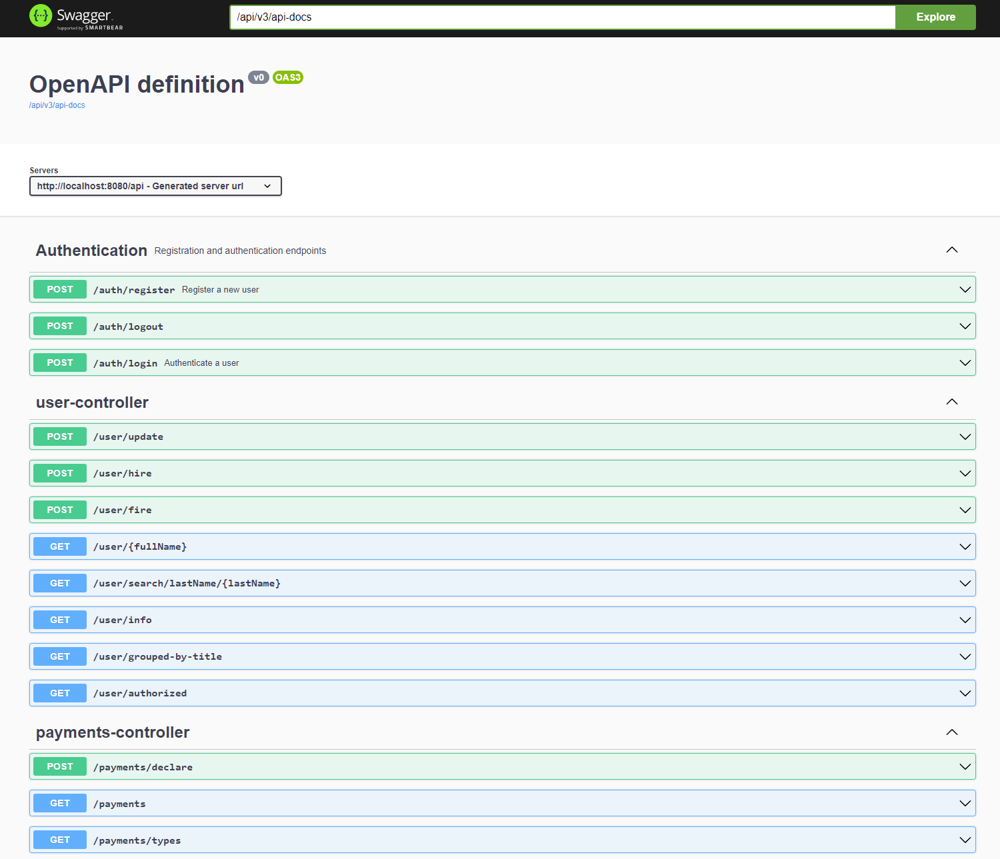

# Attorney Analytics

## Description

ERP system for the Attorney Firm. It's my graduate work of 4th course Bachelor of Science (KPI, 2024).  
It allows to control firm in wide range of aspects, such as managing company's employees, clients, legal cases, 
declaring payments and provides crucial analytic stats, such as income/outcomes by months, clients and attorneys.  
During developing of this project I've faced and successfully dealt with such troubles, like securing application with 
Google OAuth2 along with JWT tokens, bootstrapping DB with Liquibase and writing integration tests with Docker containers.
From the frontend part I had the first experience with seamless dark mode switch and internationalization,
creating pagination, custom CRUD tables and using different ChartJS charts.    

Few words about ERP [domain](assets/images/domain.png) model:
- User - serves as employee (worker, attorney...) and as site user in the same time. Has such properties, as first/last names, bio, title, emails, phones, locations, admissions etc.
- Client - records about clients we work with.
- Legal case - presents legal case that we handle for clients. Of course, it has assigned clients, attorneys, title, description, status, type and assigned payments.
- Payment - describes money transfer, which can be income (in out profit) or outcome for some case.

## Table of Contents

- [Demo](#demo)
- [Features](#features)
- [Installation](#installation)
- [Usage](#usage)

## Demo

[YouTube video demo](https://youtu.be/SeNbW0Mpe2M)

[Domain model diagram](assets/images/domain.png)

## Features

- Secure authentication: accounts are protected with Spring Security 6. 
You can login/register via regular login/password credentials or by the Google OAuth2.
If you are using API directly, don't forget to add `Authentication` header with `Bearer <TOKEN>` value.
In regular usage of application through browser, authentication process consists of passing JWT token, securely hidden in `httpOnly` cookie.
- Change color theme (light/dark) via switch
- Change site language (currently only ukrainian and english languages available)
- By default, user will be created only with `WORKER` role, that means that many features will be unavailable for your.
However, admins can login via extra `ADMIN` role, their accounts can be created directly by affecting DB or can be used default admin account,
that is being created along with DB bootstrapping on first application start.
- After registering, attorney has no title, and respectively, it will not be listed at the employees page. In order to appear there, 
administrator should give such attorney a title. This can be done by admin at the `/dashboard/promote-employee` page
- `/analytics` page allows you to see firm stats between dates, get 'Attorneys of the month' board and see latest closed cases and firm state 
- `/dashboard` page allows you to manage firm resources, such as employees hiring/firing, promoting, check salary bonus suggestions,
declaring payment and adding new client.
- `/payments`, `/clients` are regular pageable listings of according entities
- `/employees` shows list of attorneys, grouped by title. Each attorney can be viewed separately at his individual page.
- `/cases` shows pageable listing of legal cases. They also have their individual pages.

## Installation

1. Clone this repo using `git clone <URL>`
2. Ensure that Java 17+ and MySQL are installed
3. Fill out MySQL username and password in `resources/application.properties`
   and `resources/liquibase.properties`
4. Google OAuth client-id is required. Instruction about how it obtain: https://developers.google.com/identity/oauth2/web/guides/get-google-api-clientid
5. Grab your client-id and put it to the `application.properties`
6. In your frontend root folder, create `.env` file from `.env.sample`
7. Start backend API
8. Run frontend React app by `cd frontend` and `npm run start` or build optimized production build by running `npm run build`

## Usage

As this application positioned as Fullstack, we can use it in both ways - like an RESTful API
or like regular web-site - via browser.  
In order to use it like API, we can refer to the swagger at the `/api/swagger-ui/index.html#/` endpoint:

or just by regular request sending through Postman or any other tool.

---

## Technologies used

### Backend:

### Frontend:

